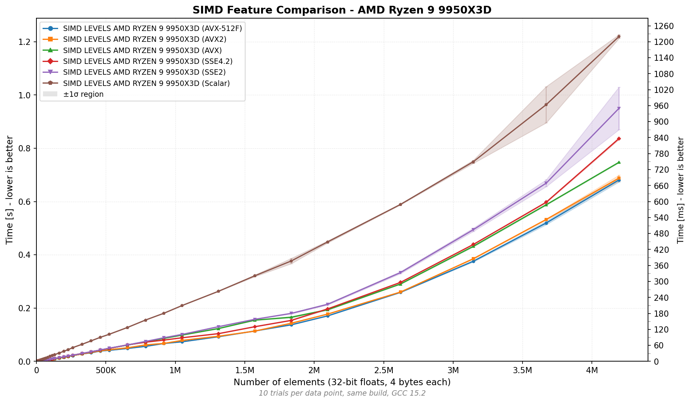
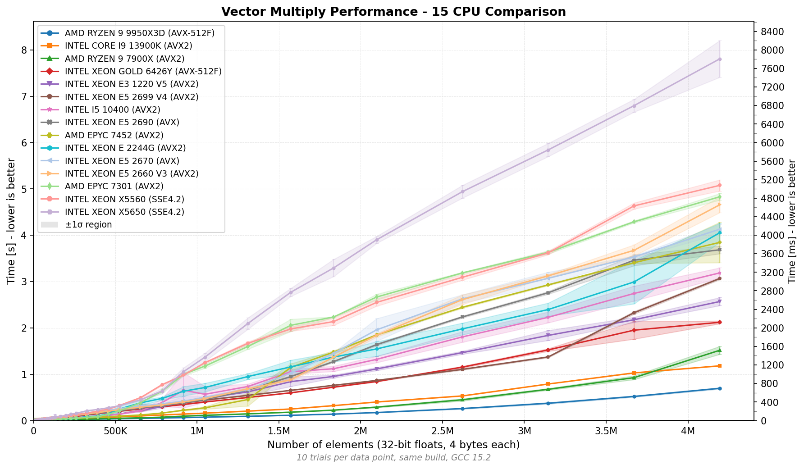

<div align="center">

<h1 align="center">libdynemit</h1>

[](https://en.cppreference.com/w/c/23)
[](https://cmake.org/)
[](https://gcc.gnu.org/)
[](https://www.boost.org/LICENSE_1_0.txt)

> **Write once, run efficiently everywhere without pain.**

libdynemit leverages GCC's ifunc resolver to automatically select optimal SIMD implementations at program startup, delivering portable code without sacrificing performance.

</div>

## Example

```c
#include <dynemit.h>

// Automatically uses AVX-512, AVX2, AVX, SSE4.2, SSE2 or scalar,
// based on your CPU's capabilities, decided once at program startup
vector_mul_f32(a, b, result, n);
```

## Performance Benchmarks

<table>
<tr>
<td width="45%">

### Forced SIMD instructions without dynamic dispatch



*Performance scaling comparison of different SIMD instruction sets on the same CPU (AMD Ryzen 9 9950X3D). This benchmark demonstrates the progressive performance improvements from Scalar → SSE2 → SSE4.2 → AVX → AVX2 → AVX-512F. Each implementation was built and tested separately to isolate the impact of each SIMD level. The chart shows ~1.8x speedup from AVX-512F compared to scalar code for large arrays. Lower execution time indicates better performance. Each data point represents the median of 10 trials, with error bars showing ±1 standard deviation.*

</td>
<td width="55%">

### Same build, best performance



*Benchmark comparing vector multiplication performance across different CPU architectures using the same build binary. The library automatically detected and utilized each CPU's highest supported SIMD instruction set (AVX-512F, AVX2, AVX or SSE4.2) at runtime. Lower execution time indicates better performance. Each data point represents the median of 10 trials, with error bars showing ±1 standard deviation.*

</td>
</tr>
</table>

## Requirements

<details open>
<summary>Ubuntu/Debian</summary>

```bash
# Update package list
sudo apt update

# Install GCC 13+ and CMake
sudo apt install -y gcc-13 cmake

# Set GCC 13 as default (optional)
sudo update-alternatives --install /usr/bin/gcc gcc /usr/bin/gcc-13 100

# Verify installation
gcc --version
cmake --version
```

</details>

<details>
<summary>Fedora/RHEL</summary>

```bash
sudo dnf install -y gcc cmake
```

</details>


<details>
<summary>Arch Linux</summary>

```bash
sudo pacman -S gcc cmake
```

</details>

## Build Instructions

```bash
# Clone the libdynemit project into your machine
git clone git@github.com:MuriloChianfa/libdynemit.git
cd libdynemit

# Setup the release build using all the optimizations
mkdir build && cd build
cmake .. -DCMAKE_BUILD_TYPE=Release

# Compile
make
```

## Installation

```bash
# Install library and headers
cd build
sudo make install
```

<details>
<summary>View installed files</summary>

**Libraries** (6 options available):
- `/usr/local/lib/libdynemit.a` (all-in-one, includes all features)
- `/usr/local/lib/libdynemit_core.a` (just CPU detection)
- `/usr/local/lib/libdynemit_vector_add.a` (single feature)
- `/usr/local/lib/libdynemit_vector_mul.a` (single feature)
- ... and more

**Headers:**
- `/usr/local/include/dynemit.h` (umbrella header)
- `/usr/local/include/dynemit/core.h`
- `/usr/local/include/dynemit/vector_add.h`
- `/usr/local/include/dynemit/vector_mul.h`
- ... and more

</details>

## Library Usage Options

The library provides flexible usage options depending on your needs:

<details open>
<summary><b>Option 1: All-in-One Library</b> (Recommended for Simplicity)</summary>

Use the bundled library that includes all features:

```c
#include <dynemit.h>  // Includes core + all features

int main(void) {
    // Query available features at runtime
    const char **features = dynemit_features();
    printf("Available features:\n");
    for (int i = 0; features[i] != NULL; i++) {
        printf("  - %s\n", features[i]);
    }
    
    simd_level_t level = detect_simd_level();
    printf("SIMD level: %s\n", simd_level_name(level));
    
    // Use any of the vector operations
    float a[1024], b[1024], result[1024];
    vector_add_f32(a, b, result, 1024);
    vector_mul_f32(a, b, result, 1024);
    vector_sub_f32(a, b, result, 1024);
    
    return 0;
}
```

Compile and link:
```bash
gcc -O3 myprogram.c -ldynemit -lm -o myprogram
```

</details>

<details open>
<summary><b>Option 2: Modular Libraries</b> (For Minimal Binary Size)</summary>

Include only the features you need:

```c
#include <dynemit/core.h>
#include <dynemit/vector_add.h>
#include <dynemit/vector_mul.h>

int main(void) {
    simd_level_t level = detect_simd_level();
    float a[1024], b[1024], result[1024];
    
    vector_add_f32(a, b, result, 1024);
    vector_mul_f32(a, b, result, 1024);
    
    return 0;
}
```

Compile and link:
```bash
gcc -O3 myprogram.c -ldynemit_core -ldynemit_vector_add -ldynemit_vector_mul -lm -o myprogram
```

</details>

<details>
<summary><b>Option 3: Core Only</b></summary>

If you only need CPU detection:

```c
#include <dynemit/core.h>

int main(void) {
    simd_level_t level = detect_simd_level();
    printf("CPU supports: %s\n", simd_level_name(level));
    return 0;
}
```

Compile and link:
```bash
gcc -O3 myprogram.c -ldynemit_core -lm -o myprogram
```

</details>

## Development

### How It Works (Technical Details)

### 1. CPU Feature Detection

The `detect_simd_level()` function uses CPUID and XGETBV instructions to query:
- Available instruction set extensions (SSE2, SSE4.2, AVX, AVX2, AVX-512F)
- OS support for saving/restoring SIMD register state (XCR0)

```c
simd_level_t level = detect_simd_level();
// Returns highest supported SIMD level
```

### 2. Multiple SIMD Implementations

Each SIMD level has its own implementation compiled with appropriate GCC target attributes:

```c
__attribute__((target("avx2")))
static void vector_mul_f32_avx2(const float *a, const float *b, float *out, size_t n)
{
    // AVX2 implementation using 256-bit YMM registers
}
```

### 3. Runtime Dispatch with ifunc

The `vector_mul_f32()` function uses GCC's ifunc attribute to resolve to the optimal implementation:

```c
vector_mul_f32_func_t vector_mul_f32_resolver(void)
{
    simd_level_t level = detect_simd_level();
    switch (level) {
        case SIMD_AVX512F: return vector_mul_f32_avx512f;
        case SIMD_AVX2:    return vector_mul_f32_avx2;
        // ... other cases
    }
}

void vector_mul_f32(const float *, const float *, float *, size_t)
    __attribute__((ifunc("vector_mul_f32_resolver")));
```

This happens **once** at program load time, making subsequent calls as fast as direct function calls.

For more details on the internal architecture, see [docs/ARCHITECTURE.md](docs/ARCHITECTURE.md).

### Verifying SIMD Instructions

Use the included verification script to inspect which SIMD instructions were compiled into the binary:

```bash
./scripts/check_for_simd.sh
```

This will show:
- All function variants in the symbol table
- Actual SIMD instructions used in each implementation
- The ifunc resolver function that performs runtime dispatch


<details>
<summary><b>Project Structure</b></summary>

## Project Structure

```
libdynemit/
├── CMakeLists.txt          # Main CMake configuration
├── include/
│   ├── dynemit.h           # Umbrella header (includes all features)
│   └── dynemit/
│       ├── core.h          # CPU detection API
│       ├── vector_add.h    # Vector addition feature
│       ├── vector_mul.h    # Vector multiplication feature
│       └── ... and more
├── src/
│   ├── CMakeLists.txt      # Core library build config
│   ├── dynemit.c           # CPU feature detection implementation
│   └── dynemit_features.c  # Feature list for all-in-one library
├── features/
│   ├── vector_add/
│   │   ├── CMakeLists.txt
│   │   └── vector_add.c    # SIMD add implementations
│   ├── vector_mul/
│   │   ├── CMakeLists.txt
│   │   └── vector_mul.c    # SIMD multiply implementations
│   └── ... and more
├── bench/
│   ├── CMakeLists.txt      # Benchmark CMake config
│   ├── benchmark_vector_mul.c  # Benchmark program
│   └── data/               # Benchmark results (CSV files)
├── tests/
│   ├── CMakeLists.txt      # Tests CMake config
│   ├── test_features.c     # Feature discovery test
│   └── test_vector_ops.c   # Vector operations correctness test
├── docs/
│   ├── ADDING_FEATURES.md  # Guide for adding new features
│   ├── ARCHITECTURE.md     # Internal architecture documentation
│   ├── BENCHMARKING.md     # Benchmarking and visualization guide
│   └── img/                # Generated benchmark charts
├── scripts/
│   ├── check_for_simd.sh   # Verify SIMD instructions in binary
│   ├── plot_benchmark.py   # Generate benchmark visualization charts
│   └── requirements.txt    # Python dependencies for visualization
└── README.md
```

</details>

<details>
<summary><b>Build Options</b></summary>

```bash
# Debug build
cmake .. -DCMAKE_BUILD_TYPE=Debug

# Release build (default, -O3 optimization)
cmake .. -DCMAKE_BUILD_TYPE=Release

# List available features
cmake .. -DLIST_FEATURES=ON
```

</details>

<details>
<summary><b>Running Tests</b></summary>

```bash
# Build and run tests
cd build
make
ctest --verbose

# Or run individual test
./tests/test_features
```

</details>

<details>
<summary><b>Running Benchmarks</b></summary>

The benchmark program measures **single-core** performance across multiple array sizes and SIMD levels:

**Quick benchmark (human-readable output):**
```bash
./build/bench/benchmark_vector_mul
```

Example output:
```
===========================================
Vector Multiply Benchmark
===========================================
Detected SIMD level: AVX2
(this is the version the ifunc dispatcher will pick)

--- Benchmarking size: 1024 elements ---
  n = 1024, iters = 5000
  time per call = 0.001234 ms
  GFLOP/s = 0.8296
  correctness: OK
...
```

**Auto-detect CPU and save results:**
```bash
./build/bench/benchmark_vector_mul --auto-detect
# Automatically creates: bench/data/results_<cpu_model>_<simd_level>.csv
```

**Generate CSV data for visualization:**
```bash
./build/bench/benchmark_vector_mul --csv > results.csv
```

**Create performance charts:**
```bash
# Install Python dependencies (first time only)
pip install -r scripts/requirements.txt

# Generate chart (labels auto-inferred from filenames)
python scripts/plot_benchmark.py bench/data/*.csv
```

For detailed benchmarking instructions, including how to compare different SIMD levels and CPUs, see [docs/BENCHMARKING.md](docs/BENCHMARKING.md).

</details>

---

### Adding New Features

For detailed instructions on how to add new SIMD-optimized features, see [docs/ADDING_FEATURES.md](docs/ADDING_FEATURES.md).

Quick summary:

1. **Create feature directory**: `features/your_feature/`
2. **Add source file**: `features/your_feature/your_feature.c`
3. **Create header**: `include/dynemit/your_feature.h`
4. **Add CMakeLists.txt** following the pattern:
   ```cmake
   # Object library for bundling
   add_library(your_feature_obj OBJECT your_feature.c)
   target_include_directories(your_feature_obj PRIVATE ${PROJECT_SOURCE_DIR}/include)
   target_link_libraries(your_feature_obj PUBLIC dynemit_core)
   
   # Individual static library
   add_library(dynemit_your_feature STATIC $<TARGET_OBJECTS:your_feature_obj>)
   target_include_directories(dynemit_your_feature PUBLIC ${PROJECT_SOURCE_DIR}/include)
   target_link_libraries(dynemit_your_feature PUBLIC dynemit_core)
   
   # Installation
   install(TARGETS dynemit_your_feature ARCHIVE DESTINATION ${CMAKE_INSTALL_LIBDIR})
   install(FILES ${PROJECT_SOURCE_DIR}/include/dynemit/your_feature.h 
           DESTINATION ${CMAKE_INSTALL_INCLUDEDIR}/dynemit)
   ```
5. **Update main CMakeLists.txt**: Add to `dynemit` all-in-one library
6. **Update umbrella header**: Add `#include <dynemit/your_feature.h>` in `include/dynemit.h`

## Contributing

Contributions are welcome! Areas for improvement:
- Additional SIMD operations (add, subtract, fused multiply-add, etc.)
- ARM NEON support
- AMD-specific optimizations (FMA4, XOP)
- Additional benchmarks and test cases

## License

See [LICENSE](LICENSE) file for details.

## References

- [Intel Intrinsics Guide](https://www.intel.com/content/www/us/en/docs/intrinsics-guide/index.html)
- [GCC Function Multi-versioning](https://gcc.gnu.org/onlinedocs/gcc/Function-Multiversioning.html)
- [GCC ifunc Attribute](https://gcc.gnu.org/onlinedocs/gcc/Common-Function-Attributes.html#index-ifunc-function-attribute)
- [x86 CPUID Instruction](https://en.wikipedia.org/wiki/CPUID)
