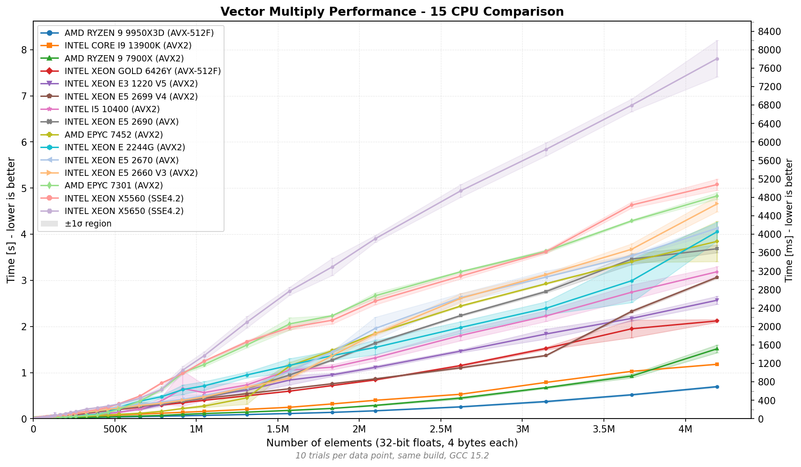
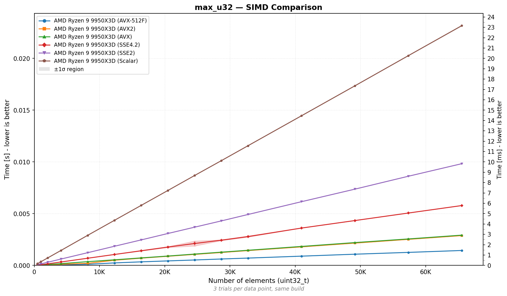
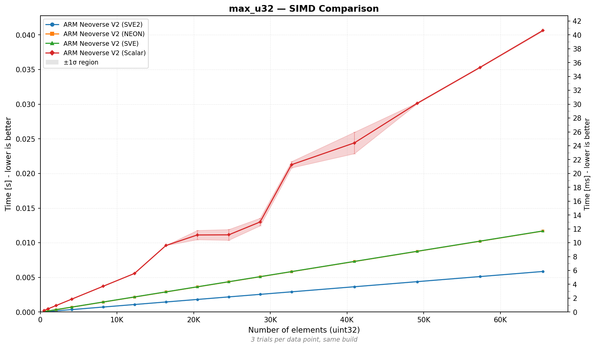

<div align="center">

<h1 align="center">libdynemit</h1>

[](https://gcc.gnu.org/onlinedocs/gcc/Standards.html)
[](https://codecov.io/gh/MuriloChianfa/libdynemit)
[](https://cmake.org/)
[](https://gcc.gnu.org/)
[](https://clang.llvm.org/)
[](https://en.wikipedia.org/wiki/Comparison_of_instruction_set_architectures)
[](https://www.boost.org/LICENSE_1_0.txt)

libdynemit leverages the ifunc resolver (supported by both GCC and Clang on Linux) to automatically select optimal SIMD implementations at program startup, delivering portable code without sacrificing performance. Thread-safe SIMD detection and dlopen-safe resolver utilities ensure robust operation in multi-threaded applications and dynamic library loading scenarios.

</div>

## Example

```c
#include <dynemit.h>

// Automatically uses AVX-512, AVX2, AVX, SSE4.2, SSE2 or scalar,
// based on your CPU's capabilities, decided once at program startup
mul_f32(a, b, result, n);
mean_f64(data, n);
entropy_u32(data, n);
```

## Same build, best performance


*Benchmark comparing vector multiplication performance across different CPU architectures using the same build binary. The library automatically detected and utilized each CPU's highest supported SIMD instruction set (AVX-512F, AVX2, AVX or SSE4.2) at runtime. Lower execution time indicates better performance. Each data point represents the median of 10 trials, with error bars showing ±1 standard deviation.*

## Forced SIMD instructions without dynamic dispatch

<table>
<tr>
<td align="center"><b>x86_64</b> : AMD Ryzen 9 9950X3D</td>
<td align="center"><b>aarch64</b> : ARM Neoverse V2</td>
</tr>
<tr>
<td></td>
<td></td>
</tr>
</table>

*Performance scaling of `max_u32` across SIMD levels on two architectures, x86_64 (Scalar → SSE2 → SSE4.2 → AVX → AVX2 → AVX-512F) and aarch64 (Scalar → NEON → SVE → SVE2). Each implementation is compiled into the same binary and the ifunc resolver selects the best one at startup. Lower execution time is better, each point is the median of 3 trials with ±1 standard deviation error bars.*


## Installation

### Option 1: Pre-built Packages

Download pre-built packages from [GitHub Releases](https://github.com/MuriloChianfa/libdynemit/releases).

<details open>
<summary><b>Debian/Ubuntu</b></summary>

```bash
wget https://github.com/MuriloChianfa/libdynemit/releases/download/v1.2.0/libdynemit_1.2.0_amd64.deb
sudo dpkg -i libdynemit_1.2.0_amd64.deb
```

</details>

<details>
<summary><b>Fedora/RHEL</b></summary>

**Runtime package**:

```bash
wget https://github.com/MuriloChianfa/libdynemit/releases/download/v1.2.0/libdynemit-1.2.0-1.fc40.x86_64.rpm
sudo dnf install libdynemit-1.2.0-1.fc40.x86_64.rpm
```

</details>

#### Verify GPG Signatures

All packages are cryptographically signed with GPG for authenticity verification.

**Import the maintainer's public key:**

```bash
gpg --keyserver keys.openpgp.org --recv-keys 3E1A1F401A1C47BC77D1705612D0D82387FC53B0
```

<details>
<summary><b>Alternative key import options</b></summary>

Using the shorter key ID:

```bash
gpg --keyserver keys.openpgp.org --recv-keys 12D0D82387FC53B0
```

**Alternative keyserver** (if `keys.openpgp.org` is unavailable):

```bash
gpg --keyserver hkp://keyserver.ubuntu.com --recv-keys 3E1A1F401A1C47BC77D1705612D0D82387FC53B0
```

</details>

You should see output confirming the key was imported:
```
gpg: key 12D0D82387FC53B0: public key "MuriloChianfa <murilo.chianfa@outlook.com>" imported
gpg: Total number processed: 1
gpg:               imported: 1
```

**Verify a package signature:**

```bash
gpg --verify libdynemit_1.2.0_amd64.deb.asc libdynemit_1.2.0_amd64.deb
```

If the signature is valid, you should see:
```
gpg: Signature made [date and time]
gpg:                using EDDSA key 3E1A1F401A1C47BC77D1705612D0D82387FC53B0
gpg: Good signature from "MuriloChianfa <murilo.chianfa@outlook.com>"
```

If you see "BAD signature", **do not use** the binary - it may have been tampered with or corrupted.

#### Verify Checksums

```bash
curl -LO https://github.com/MuriloChianfa/libdynemit/releases/download/v1.2.0/SHA256SUMS
curl -LO https://github.com/MuriloChianfa/libdynemit/releases/download/v1.2.0/SHA256SUMS.asc
gpg --verify SHA256SUMS.asc SHA256SUMS
sha256sum -c SHA256SUMS --ignore-missing
```

### Option 2: Build from Source

## Requirements

<details open>
<summary>Ubuntu/Debian</summary>

```bash
# Update package list
sudo apt update

# Install GCC 13+ and CMake
sudo apt install -y gcc-13 cmake

# Verify installation
gcc --version
cmake --version
```

</details>

<details>
<summary>Fedora/RHEL</summary>

```bash
sudo dnf install -y gcc cmake
```

</details>


<details>
<summary>Arch Linux</summary>

```bash
sudo pacman -S gcc cmake
```

</details>


## Build Instructions

```bash
# Clone the libdynemit project into your machine
git clone git@github.com:MuriloChianfa/libdynemit.git
cd libdynemit

# Setup the release build using all the optimizations
mkdir build && cd build
cmake .. -DCMAKE_BUILD_TYPE=Release

# Compile
make
```

### Installing from Source

After building, install the library and headers system-wide:

```bash
cd build
sudo make install
```

<details>
<summary>View installed files</summary>

**Shared library**:
- `/usr/local/lib/libdynemit.so.1.2.0` (versioned shared library)
- `/usr/local/lib/libdynemit.so.1` (SONAME symlink)
- `/usr/local/lib/libdynemit.so` (development symlink)

**Static libraries**:
- `/usr/local/lib/libdynemit.a` (all-in-one, includes all features)
- `/usr/local/lib/libdynemit_core.a` (just CPU detection)
- `/usr/local/lib/libdynemit_add.a`, `libdynemit_sub.a`, `libdynemit_mul.a` (vector ops)
- `/usr/local/lib/libdynemit_sum.a`, `libdynemit_mean.a`, `libdynemit_min.a`, `libdynemit_max.a` (basic stats)
- `/usr/local/lib/libdynemit_variance.a`, `libdynemit_skewness.a`, `libdynemit_kurtosis.a` (moments)
- `/usr/local/lib/libdynemit_entropy.a`, `libdynemit_simpson.a`, `libdynemit_hhi.a`, `libdynemit_gini.a` (diversity)
- `/usr/local/lib/libdynemit_histogram.a`, `libdynemit_topk.a`, `libdynemit_hill.a`, `libdynemit_concentration.a` (histogram & concentration)

**Headers:**
- `/usr/local/include/dynemit.h` (umbrella header)
- `/usr/local/include/dynemit/core.h` (CPU detection, SIMD levels)
- `/usr/local/include/dynemit/compiler.h` (compiler portability macros)
- `/usr/local/include/dynemit/err.h` (safe IFUNC resolver utilities)
- `/usr/local/include/dynemit/add.h`, `sub.h`, `mul.h` (vector ops)
- `/usr/local/include/dynemit/stats.h` (convenience: includes all statistics headers below)
- `/usr/local/include/dynemit/sum.h`, `mean.h`, `min.h`, `max.h`, `variance.h`, `skewness.h`, `kurtosis.h`
- `/usr/local/include/dynemit/entropy.h`, `simpson.h`, `hhi.h`, `gini.h`
- `/usr/local/include/dynemit/histogram.h`, `topk.h`, `hill.h`, `concentration.h`

**Build system support:**
- `/usr/local/lib/pkgconfig/libdynemit.pc` (pkg-config file)

</details>

## Features

Currently the library ships SIMD-accelerated features organized into four categories. Every function automatically dispatches to the best available instruction set at program startup.

<details>
<summary><b>Vector Operations</b></summary>

Element-wise operations on `float` arrays.

| Function | Description |
|---|---|
| `add_f32(a, b, out, n)` | `out[i] = a[i] + b[i]` |
| `sub_f32(a, b, out, n)` | `out[i] = a[i] - b[i]` |
| `mul_f32(a, b, out, n)` | `out[i] = a[i] * b[i]` |

Header: `<dynemit/add.h>`, `<dynemit/sub.h>`, `<dynemit/mul.h>`

</details>

<details open>
<summary><b>Statistical Primitives</b></summary>

| Function | Description |
|---|---|
| `sum_f64` / `sum_u64` / `sum_u32` / `sum_u16` | Sum of elements |
| `mean_f64` / `mean_u64` / `mean_u32` / `mean_u16` | Arithmetic mean |
| `min_f64` / `min_u64` / `min_u32` / `min_u16` | Minimum value |
| `max_f64` / `max_u64` / `max_u32` / `max_u16` | Maximum value |
| `variance_f64` | Sample variance (Bessel's correction) |
| `skewness_f64` | Third standardized moment |
| `kurtosis_f64` | Excess kurtosis (fourth moment - 3) |

Headers: `<dynemit/sum.h>`, `<dynemit/mean.h>`, `<dynemit/min.h>`, `<dynemit/max.h>`, `<dynemit/variance.h>`, `<dynemit/skewness.h>`, `<dynemit/kurtosis.h>`

Convenience header `<dynemit/stats.h>` includes all of the above.

</details>

<details>
<summary><b>Distribution & Diversity Metrics</b></summary>

| Function | Description |
|---|---|
| `entropy_u16` / `entropy_u32` / `entropy_histogram` | Shannon entropy (bits) |
| `simpson_u16` / `simpson_u32` / `simpson_histogram` | Simpson's diversity index |
| `hhi_u16` / `hhi_u32` / `hhi_histogram` | Herfindahl-Hirschman Index |
| `gini_f64` / `gini_u64` | Gini coefficient (requires sorted input) |
| `hll_u32` / `hll_u64` | HyperLogLog++ approximate distinct-count estimator |

Headers: `<dynemit/entropy.h>`, `<dynemit/simpson.h>`, `<dynemit/hhi.h>`, `<dynemit/gini.h>`, `<dynemit/hll.h>`

</details>

<details>
<summary><b>Histogram & Concentration Analysis</b></summary>

| Function | Description |
|---|---|
| `histogram_u16` / `histogram_u64` | Count elements into boundary-defined bins |
| `topk_ratios_f64` | Top-K concentration ratios from sorted descending counts |
| `hill_estimator_f64` | Hill heavy-tail index estimator |
| `concentration_f64` | Composite metric combining top-K, Hill, and HHI |

Headers: `<dynemit/histogram.h>`, `<dynemit/topk.h>`, `<dynemit/hill.h>`, `<dynemit/concentration.h>`

</details>

<details>
<summary><b>Sorting</b></summary>

| Function | Description |
|---|---|
| `radixs_u16(in, out, n)` | 16-bit counting sort (no caller scratch) |
| `radixs_u32(in, out, n)` | 8-bit LSD radix sort (4 passes); falls back to qsort if scratch alloc fails |
| `radixs_u64(in, out, n)` | 8-bit LSD radix sort (8 passes); falls back to qsort if scratch alloc fails |

Header: `<dynemit/radixs.h>`

The AVX-512F and AVX-512 VBMI2 variants use `vpconflictd`/`vpconflictq` to detect within-vector duplicates and `vpscatterdd`/`vpscatterqq` for the scatter pass; the VBMI2 path additionally uses `vpermb` to extract digit bytes in a single permute.

</details>

## Library Usage Options

The library provides flexible usage options depending on your needs:

<details open>
<summary><b>Option 1: All-in-One Library</b> (Recommended for Simplicity)</summary>

Use the bundled library that includes all features:

```c
#include <dynemit.h>  // Includes core + all features

int main(void) {
    const char **features = dynemit_features();
    printf("Available features:\n");
    for (int i = 0; features[i] != NULL; i++) {
        printf("  - %s\n", features[i]);
    }
    
    simd_level_t level = detect_simd_level();
    printf("SIMD level: %s\n", simd_level_name(level));
    
    float a[1024], b[1024], result[1024];
    add_f32(a, b, result, 1024);
    mul_f32(a, b, result, 1024);
    sub_f32(a, b, result, 1024);
    
    double data[1024];
    double avg = mean_f64(data, 1024);
    double var = variance_f64(data, 1024);
    
    return 0;
}
```

Compile and link:
```bash
gcc -O3 myprogram.c -ldynemit -lm -o myprogram
```

</details>

<details open>
<summary><b>Option 2: Modular Libraries</b> (For Minimal Binary Size)</summary>

Include only the features you need:

```c
#include <dynemit/core.h>
#include <dynemit/add.h>
#include <dynemit/mul.h>
#include <dynemit/mean.h>

int main(void) {
    simd_level_t level = detect_simd_level();
    float a[1024], b[1024], result[1024];
    
    add_f32(a, b, result, 1024);
    mul_f32(a, b, result, 1024);
    
    double data[1024];
    double avg = mean_f64(data, 1024);
    
    return 0;
}
```

Compile and link:
```bash
gcc -O3 myprogram.c -ldynemit_core -ldynemit_add -ldynemit_mul -ldynemit_mean -lm -o myprogram
```

</details>

<details>
<summary><b>Option 3: Core Only</b></summary>

If you only need CPU detection:

```c
#include <dynemit/core.h>

int main(void) {
    simd_level_t level = detect_simd_level();
    printf("CPU supports: %s\n", simd_level_name(level));
    return 0;
}
```

Compile and link:
```bash
gcc -O3 myprogram.c -ldynemit_core -lm -o myprogram
```

</details>

## C++ Compatibility

The library is fully compatible with C++ and includes `extern "C"` guards in all headers. You can use it seamlessly in C++ projects:

<details open>
<summary><b>Basic C++ Usage</b></summary>

```cpp
#include <dynemit.h>
#include <vector>
#include <iostream>

int main() {
    simd_level_t level = detect_simd_level();
    std::cout << "SIMD Level: " << simd_level_name(level) << std::endl;
    
    std::vector<float> a(1024, 1.0f);
    std::vector<float> b(1024, 2.0f);
    std::vector<float> result(1024);
    
    mul_f32(a.data(), b.data(), result.data(), a.size());
    add_f32(a.data(), b.data(), result.data(), a.size());
    sub_f32(a.data(), b.data(), result.data(), a.size());
    
    std::vector<double> data(1024, 3.14);
    double avg = mean_f64(data.data(), data.size());
    double var = variance_f64(data.data(), data.size());
    
    return 0;
}
```

Compile and link with g++:
```bash
g++ -std=c++17 -O3 myprogram.cpp -ldynemit -lm -o myprogram
```

</details>

<details>
<summary><b>C++ with Custom IFUNC Resolvers</b></summary>

You can use the `EXPLICIT_RUNTIME_RESOLVER` macro in C++ to create your own IFUNC resolvers:

```cpp
#include <dynemit/core.h>
#include <dynemit/err.h>

// Define implementations
static void my_func_scalar(float* out, const float* in, size_t n) { /* ... */ }
static void my_func_avx2(float* out, const float* in, size_t n) { /* ... */ }
static void my_func_avx512(float* out, const float* in, size_t n) { /* ... */ }

// Create resolver with C++ type safety
#pragma GCC diagnostic push
#pragma GCC diagnostic ignored "-Wpedantic"

EXPLICIT_RUNTIME_RESOLVER(my_func_resolver) {
    simd_level_t level = detect_simd_level_ts();
    
    switch (level) {
    case SIMD_AVX512F:
        return reinterpret_cast<void*>(my_func_avx512);
    case SIMD_AVX2:
        return reinterpret_cast<void*>(my_func_avx2);
    default:
        return reinterpret_cast<void*>(my_func_scalar);
    }
}

#pragma GCC diagnostic pop

extern "C" void my_func(float* out, const float* in, size_t n)
    __attribute__((ifunc("my_func_resolver")));
```

</details>

**Notes:**
- C++17 or later is recommended for best compatibility
- All headers include proper `extern "C"` linkage guards
- Use `reinterpret_cast<void*>` for function pointers in resolvers
- The `-Wpedantic` warning about function-to-void* conversions is expected and safe for IFUNC resolvers

</details>

## Development

### How It Works (Technical Details)

### 1. CPU Feature Detection

The `detect_simd_level()` function uses CPUID and XGETBV instructions to query:
- Available instruction set extensions (SSE2, SSE4.2, AVX, AVX2, AVX-512F, AVX-512 VBMI2)
- OS support for saving/restoring SIMD register state (XCR0)

```c
simd_level_t level = detect_simd_level();
// Returns highest supported SIMD level
```

For thread-safe contexts (multi-threaded code, IFUNC resolvers, dlopen()-loaded libraries), use the cached version:

```c
simd_level_t level = detect_simd_level_ts();
// Thread-safe, cached SIMD detection
```

### 2. Multiple SIMD Implementations

Each SIMD level has its own implementation compiled with appropriate target attributes:

```c
__attribute__((target("avx2")))
static void mul_f32_avx2(const float *a, const float *b, float *out, size_t n)
{
    // AVX2 implementation using 256-bit YMM registers
}
```

### 3. Runtime Dispatch with ifunc

The `mul_f32()` function uses the ifunc attribute to resolve to the optimal implementation:

```c
mul_f32_func_t mul_f32_resolver(void)
{
    simd_level_t level = detect_simd_level();
    switch (level) {
        case SIMD_AVX512F: return mul_f32_avx512f;
        case SIMD_AVX2:    return mul_f32_avx2;
        // ... other cases
    }
}

void mul_f32(const float *, const float *, float *, size_t)
    __attribute__((ifunc("mul_f32_resolver")));
```

This happens **once** at program load time, making subsequent calls as fast as direct function calls.

For more details on the internal architecture, see [docs/ARCHITECTURE.md](docs/ARCHITECTURE.md).

### 4. Safe IFUNC Resolvers (for dlopen)

When building libraries that may be loaded via `dlopen()`, use the safe resolver utilities from `<dynemit/err.h>`:

```c
#include <dynemit/core.h>
#include <dynemit/err.h>

EXPLICIT_RUNTIME_RESOLVER(my_function_resolver)
{
    simd_level_t level = detect_simd_level_ts();  // Thread-safe!
    
    switch (level) {
        case SIMD_AVX2: return (void*)my_function_avx2;
        default:        return (void*)my_function_scalar;
    }
}
```

This ensures:
- Thread-safe, cached SIMD detection
- NULL-check protection (traps immediately instead of crashing later)
- Compatibility with Python's module loading

For detailed documentation, see [docs/IFUNC_RESOLVERS.md](docs/IFUNC_RESOLVERS.md).

### Verifying SIMD Instructions

Use the included verification script to inspect which SIMD instructions were compiled into the binary:

```bash
./scripts/check_for_simd.sh
```

This will show:
- All function variants in the symbol table
- Actual SIMD instructions used in each implementation
- The ifunc resolver function that performs runtime dispatch


<details>
<summary><b>Project Structure</b></summary>

## Project Structure

```
libdynemit/
├── CMakeLists.txt              # Main CMake configuration
├── cmake/                      # CMake modules
├── include/
│   ├── dynemit.h               # Umbrella header (includes all features)
│   └── dynemit/
│       ├── core.h              # CPU detection API
│       ├── compiler.h          # Compiler portability macros (GCC/Clang)
│       ├── err.h               # Safe IFUNC resolver utilities
│       ├── *.h                 # Features
├── src/
│   ├── CMakeLists.txt          # Core library build config
│   ├── dynemit.c               # CPU feature detection implementation
│   └── dynemit_features.c      # Feature list for all-in-one library
├── features/                   # One subdirectory per feature
│   ├── add/                    # Element-wise vector addition
│   │   ├── CMakeLists.txt      # Library + test + benchmark targets
│   │   ├── add_f32.c           # SIMD implementations
│   │   ├── tests/*             # Correctness tests
│   │   └── benchmarks/*        # Benchmarks for the feature
│   └── *
├── bench/
│   ├── bench_utils.h           # Shared benchmark infrastructure (header-only)
│   ├── cpus/                   # Per-CPU benchmark data and charts
│   │   └── {arch}/{cpu}/       # e.g. x86_64/amd_ryzen_9_9950x3d/
│   │       ├── data/           # CSV results ({variant}_{simd}.csv)
│   │       └── features/       # Per-variant charts (timing.png, throughput.png)
│   └── features/               # Cross-CPU comparison charts per variant
│       └── {variant}/          # e.g. max_u32/timing.png
├── tests/                      # Core-only tests (SIMD detection, C++ compat)
│   ├── CMakeLists.txt
│   ├── test_*
├── docs/
│   ├── ADDING_FEATURES.md      # Guide for adding new features
│   ├── ARCHITECTURE.md         # Internal architecture documentation
│   ├── DEVELOPMENT.md          # Development setup guide
│   ├── BENCHMARKING.md         # Benchmarking and visualization guide
│   └── IFUNC_RESOLVERS.md      # IFUNC resolver safety documentation
├── scripts/
│   ├── check_for_simd.sh       # Verify SIMD instructions in binary
│   ├── plot_benchmark.py       # Generate benchmark visualization charts
│   └── requirements.txt        # Python dependencies for visualization
├── mull.yml                    # Mull mutation testing config
└── README.md
```

</details>

<details>
<summary><b>Build Options</b></summary>

```bash
# Release build (default, full optimization)
cmake -B build
cmake --build build -j$(nproc)

# Release with tests and/or benchmarks
cmake -B build -DCMAKE_BUILD_TYPE=Release \
  -DDYNEMIT_BUILD_TESTS=ON \
  -DDYNEMIT_BUILD_BENCHMARKS=ON

# Debug build (tests and benchmarks on by default)
cmake -B build -DCMAKE_BUILD_TYPE=Debug

# List available features at configure time
cmake -B build -DLIST_FEATURES=ON
```

</details>

<details>
<summary><b>Running Tests</b></summary>

All C tests use the [Unity](https://github.com/ThrowTheSwitch/Unity) framework; C++ tests use [Google Test](https://github.com/google/googletest). Both are fetched automatically via CMake FetchContent when tests are enabled.

```bash
# Run the full test suite (core + all features)
ctest --test-dir build --output-on-failure

# Run a single feature test directly
./build/features/add/test_add
./build/features/sum/test_sum
```

Each feature has its own tests under `features/<name>/tests/` that cover correctness across multiple input sizes and all reachable SIMD variants (via the `_select()` API). Core tests in `tests/` cover SIMD detection, resolver macros, feature discovery, and C++ compatibility.

</details>

<details>
<summary><b>Code Coverage</b></summary>

Generate an HTML coverage report over all tests (requires GCC, `lcov`, and `genhtml`):

```bash
cmake -B build-cov -DCMAKE_BUILD_TYPE=Debug -DDYNEMIT_COVERAGE=ON
cmake --build build-cov -j$(nproc)
cmake --build build-cov --target coverage
```

Open `build-cov/coverage_report/index.html` in a browser. The coverage target zeroes counters, runs the full test suite, captures line/function/branch data, and filters to only project source files.

CI uploads merged coverage from five jobs (x86 native, x86 SDE AVX-512, x86 TLS, aarch64 native, aarch64 QEMU SVE). See [docs/DEVELOPMENT.md](docs/DEVELOPMENT.md#ci-coverage-matrix) for local SDE/QEMU usage.

</details>

<details>
<summary><b>Mutation Testing</b></summary>

[Mull](https://github.com/mull-project/mull) injects mutations into compiled bitcode to verify test quality. Requires Clang and the `mull` package.

```bash
# Build with the Mull pass plugin
cmake -B build-mull -DCMAKE_C_COMPILER=clang -DDYNEMIT_MULL=ON
cmake --build build-mull -j$(nproc)

# Run mutation testing on individual test binaries
mull-runner-20 ./build-mull/features/add/test_add
mull-runner-20 ./build-mull/features/sum/test_sum
```

The `mull.yml` config at the project root controls which mutators are active.

</details>

<details>
<summary><b>Running Benchmarks</b></summary>

Each feature variant has its own benchmark binary under `features/<name>/benchmarks/`. Benchmark binaries use explicit type suffixes (e.g. `bench_max_f64`, `bench_max_u32`). Benchmarks measure single-core performance across multiple array sizes and all SIMD levels using the shared infrastructure in `bench/bench_utils.h`.

```bash
# Run all variants x all SIMD levels, pinned to one core, max nice priority
sudo ./scripts/run_all_benchmarks.sh --cpu 15

# Or run a single variant benchmark directly
./build/features/add/bench_add_f32
./build/features/add/bench_add_f32 --auto-detect
# Creates: bench/cpus/x86_64/<cpu_model>/data/add_f32_<simd_level>.csv
```

**Regenerate charts from existing CSV data:**
```bash
bash ./scripts/run_all_benchmarks.sh --charts-only
```

**Create a portable bundle for remote servers:**
```bash
./scripts/bundle_benchmarks.sh --strip
# Produces: dynemit-bench-x86_64.tar.gz (static binaries)
```

For detailed benchmarking instructions, chart layout, and remote server workflow, see [docs/BENCHMARKING.md](docs/BENCHMARKING.md).

</details>

---

### Adding New Features

For detailed instructions on how to add new SIMD-optimized features, see [docs/ADDING_FEATURES.md](docs/ADDING_FEATURES.md).

Quick summary:

1. **Create feature directory**: `features/my_feature/`
2. **Add source files**: `features/my_feature/my_feature_f64.c` (one per type variant)
3. **Create header**: `include/dynemit/my_feature.h`
4. **Add CMakeLists.txt** following the pattern:
   ```cmake
   add_library(my_feature_obj OBJECT my_feature_f64.c)
   target_include_directories(my_feature_obj PRIVATE ${PROJECT_SOURCE_DIR}/include)
   target_link_libraries(my_feature_obj PUBLIC dynemit_core)
   
   add_library(dynemit_my_feature STATIC $<TARGET_OBJECTS:my_feature_obj>)
   target_include_directories(dynemit_my_feature PUBLIC ${PROJECT_SOURCE_DIR}/include)
   target_link_libraries(dynemit_my_feature PUBLIC dynemit_core)
   
   install(TARGETS dynemit_my_feature ARCHIVE DESTINATION ${CMAKE_INSTALL_LIBDIR})
   install(FILES ${PROJECT_SOURCE_DIR}/include/dynemit/my_feature.h 
           DESTINATION ${CMAKE_INSTALL_INCLUDEDIR}/dynemit)
   ```
5. **Register the feature**: Add it to the `features[]` array in `src/dynemit_features.c`
6. **Update umbrella header**: Add `#include <dynemit/my_feature.h>` in `include/dynemit.h`

The build system auto-discovers `features/*/` subdirectories, so no changes to the root `CMakeLists.txt` are needed.

## Contributing

Contributions are welcome! Areas for improvement:
- Additional type variants for existing features
- ARM NEON and RISC-V Vector Extension support
- AMD-specific optimizations (FMA4, XOP)
- Additional benchmarks and test cases for new features

## License

See [LICENSE](LICENSE) file for details.

## References

- [Intel Intrinsics Guide](https://www.intel.com/content/www/us/en/docs/intrinsics-guide/index.html)
- [GCC Function Multi-versioning](https://gcc.gnu.org/onlinedocs/gcc/Function-Multiversioning.html)
- [GCC ifunc Attribute](https://gcc.gnu.org/onlinedocs/gcc/Common-Function-Attributes.html#index-ifunc-function-attribute)
- [Clang Attributes Reference](https://clang.llvm.org/docs/AttributeReference.html)
- [x86 CPUID Instruction](https://en.wikipedia.org/wiki/CPUID)
